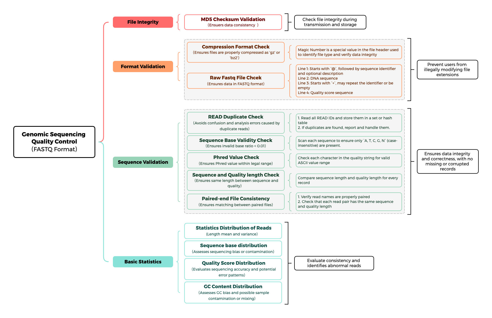

FastqCheck
=========================
An efficient tool for FASTQ sequencing data format validation and quality statistics.


__PROGRAM: fastq_check__<br>
__VERSION: 2.0.4__<br>
__PLATFORM: Linux / macOS__<br>
__ARCHITECTURE: x86_64 / arm64__<br>
__COMPILER: gcc (C99)__<br>
__AUTHOR: xiaolong zhang__<br>
__EMAIL: xiaolongzhang2015@163.com__<br>
__DATE:   2022-07-25__<br>
__UPDATE: 2026-08-17__<br>
__DEPENDENCE__<br>
* __CMake (>= 3.16) and gcc/clang__<br>
* __zlib-ng__ (bundled source tree, no system zlib required)<br>
* __bzlib__ (bundled source tree, no system bzip2 required)<br>
* __pthread__<br>


# 1. Description

* FastqCheck is a fast and reliable tool for validating the format of raw genomic FASTQ sequencing data and generating quality statistics.<br>
* It accepts plain (`.fq` / `.fastq`), gzip-compressed (`.fq.gz` / `.fastq.gz`) and bzip2-compressed (`.fq.bz2` / `.fastq.bz2`) FASTQ files, and supports **single-end** (1 file), **paired-end** (2 files) and **single-cell** (4 files) data of one sample in a single run.
* It performs **format checking** — phred quality values (33/64), pair markers (`'1'` / `'2'`), read name ordering between files, sequence/quality length consistency, invalid base ratio, and truncated file detection.
* It performs **quality statistics** — base composition (A/C/G/T/N), GC content, read length distribution, per-file statistics and quality score distribution.
* It checks **duplicate read names** with a Bloom filter (false positive rate as low as `1e-9`), so the memory usage stays tiny even for hundreds of millions of reads.
* Since v2.0.0, the check flow is redesigned as a **multithreading pipeline** (reader thread + reader threadpool + checker threadpool + duplicate-check thread, see [Architecture](#6-architecture)), which significantly speeds up the checking of large-scale data on multi-core machines.
* It writes the statistics as an **SRA-compatible XML** file (`spot_count` / `base_count` / `GC-Content` / `QualityCount` ...), which can be directly used for NCBI/CRA SRA submission, together with a text error report file.


# 2. Building


## 2.1 Dependencies

FastqCheck is built with **CMake** and a C99 compiler (gcc/clang). Both third-party
libraries are managed uniformly in the `external/` directory. The libraries are:

* **zlib-ng** — bundled as a local source tree (`external/zlibng/`) and compiled as a static library
  in the zlib-compatible mode (`ZLIB_COMPAT`), which exports the classic zlib API
  (`gzopen` / `gzread` / `gzwrite` / `gzclose` ...) with an unchanged `zlib.h`, so no system
  zlib is required
* **bzlib** — bundled as a local source tree (`external/bzip2/`) and compiled as a static library
  (the `bz2_static` target), which exports the classic bzlib API (`BZ2_bzReadOpen` /
  `BZ2_bzWriteOpen` ...), so no system bzip2 is required
* **pthread** — required for multi-threading support

## 2.2 Compilation

```bash
cd FastqCheck
cmake -S . -B build       # configure (default: Release)
cmake --build build -j    # build fastq_check
```

The compiled binary `fastq_check` will be generated in `build/`.

## 2.3 Build Options

CMake provides a `CMAKE_BUILD_TYPE` switch to select between release and debug builds:

| `CMAKE_BUILD_TYPE` | Default | Description                                                    |
|--------------------|---------|----------------------------------------------------------------|
| `Release`          | yes     | compile with `-O3` optimizations, for production use           |
| `Debug`            | no      | compile with `-g -O0`, for debugging                           |

To build the debug version (e.g. in a separate `build-debug/` directory):

```bash
cmake -S . -B build-debug -DCMAKE_BUILD_TYPE=Debug
cmake --build build-debug -j
```

Clean build artifacts:

```bash
rm -rf build build-debug
# or
cmake --build build --target clean
```


# 3. Usage

```
Usage: fastq_check -i <fastq_list.txt> -o <output_file.xml> -e <error_file.err> -x <max_reads> -P <phred_value>
Note: you MUST RUN fastq_type for file type checking before fastq_check!
```

**Prerequisites:** before running fastq_check, run `fastq_type` on the same file list. fastq_type verifies the file format (gzip/bzip2 magic code), detects truncated or renamed files, and estimates the values of `-x|--max_reads` and `-P|--phred_value` for fastq_check.


## 3.1 Options Summary

##### Required Options

| Option             | Argument | Description                                                                 |
|--------------------|----------|-----------------------------------------------------------------------------|
| `-i`, `--in_file`  | FILE     | **\[Required]** fastq file list, one sample path per line [.txt]            |
| `-o`, `--out_file` | FILE     | **\[Required]** output xml file of the given fastq files after checking [.xml] |
| `-e`, `--error_file` | FILE   | **\[Required]** warning or error message about the given fastq files [.err] |
| `-x`, `--max_reads` | INT     | **\[Required]** the estimated maximum number of reads (estimated by fastq_type) [unit: million] |
| `-P`, `--phred_value` | INT   | **\[Required]** the phred value of the fastq file (estimated by fastq_type, 33 or 64) |

##### Optional Options

| Option            | Argument | Description                                                                  |
|-------------------|----------|------------------------------------------------------------------------------|
| `-r`, `--ratio`   | INT      | the estimated compression ratio of the fastq file [default: 10]              |
| `-m`, `--max_length` | INT    | the maximum length (MB) allowed for one read sequence [default: 50 (MB)]     |
| `-t`, `--thread`  | INT      | number of thread used when processing the fastq file [default: 1]            |
| `-p`, `--pair_check` | INT    | check whether all reads have the same pair marker (1->check; 0->ignore) [default: 1] |


## 3.2 Option Details

#### \[-h \| --help]

Print the help information and exit.

---

#### \[-i \| --in_file]

A text file (without header) containing the full paths of the FASTQ files to be checked, one file per line. Both plain FASTQ (`.fq` / `.fastq`) and compressed FASTQ (`.fq.gz` / `.fastq.gz` / `.fq.bz2` / `.fastq.bz2`) are supported.

**Example:**
```
/home/user/data/sample_R1.fastq.gz
/home/user/data/sample_R2.fastq.gz
```

**Note:** One sample per run. The number of files determines the checking mode: 1 file → single-end, 2 files → paired-end, 4 files → single-cell. When only one file is provided, the pair marker checking (`-p`) is disabled automatically.

---

#### \[-o \| --out_file]

The path of the output statistics file in XML format (see [5.3 Output XML](#53-output-xml)). The recommended file extension is `.xml`.

**Example:**
```
-o /home/user/data/sample.xml
```

---

#### \[-e \| --error_file]

The path of the text file receiving all file errors and format errors (one `[FileError]` / `[FormatError]` entry per line, see [5.4 Error Codes](#54-error-codes); `[SysError]` messages are printed to the standard error instead). No output is written to this file when the checked data is completely normal.

**Example:**
```
-e /home/user/data/sample.err
```

---

#### \[-x \| --max_reads]

The estimated maximum number of reads of the sample, in millions (e.g. `500` means about 500 million reads). It is used to size the Bloom filter for duplicate read name checking: an underestimated value saturates the filter (leading to more false duplicate positives), while an overestimated value wastes memory. The value can be estimated by `fastq_type` from the file size and the compression ratio.

**Example:**
```
-x 500
```

---

#### \[-P \| --phred_value]

The phred value of the fastq files, which is **33** (Sanger / Illumina 1.3+) or **64** (Illumina 1.3- / Solexa). It is required for the quality distribution statistics: the quality scores in the output XML are reported as phred-adjusted values (`quality value - phred_value`).  The value can be obtained by tool of `fastq_type`.

---

#### \[-r \| --ratio]

The estimated compression ratio of the fastq file (e.g. `10` means the compressed file is about 1/10 of the plain text size). It is used together with `-x|--max_reads` to size the Bloom filter: when the ratio is larger than `10`, the estimated read count is scaled up by `ratio / 10`, which helps to allocate enough memory for the duplicate checking of highly compressed data.

**Default:** `10`

---

#### \[-m \| --max_length]

The maximum length (in MB) allowed for one read sequence. A read whose sequence length exceeds this value is treated as a malformed read.

**Default:** `50` (MB)

---

#### \[-t \| --thread]

The number of threads used when processing the fastq file. Since v2.0.0, this parameter controls the size of the **checker threadpool** in the multithreading pipeline (see [Architecture](#6-architecture)). Increasing the thread count can significantly speed up the checking of large-scale data on multi-core systems.

**Default:** `1`

**Example:**
```
-t 8
```

---

#### \[-p \| --pair_check]

Check whether all reads have the same pair marker (`'1'` / `'2'` after the read name). When enabled, the pair markers are detected from the read names (e.g. `@ST-E00126:HWM7:3173:1784 2:N:AAGAC` → marker `'2'`) and verified for consistency within and between files.

**Default:** `1` (check). Automatically set to `0` for single-end data (only one file in the list).


# 4. Examples


## 4.1 Get Requirement Parameters

```bash
# get params of max_reads and Phred from fastq_type
fastq_type sample_list.txt

# output of the fastq_type
SingleCell: Not Single Cell!
PhredValue: 33
MaximumReads: 100 (Million)
BloomMemory: 15 (GB)
```

## 4.2 Fastq Checking (single-end, pair-end, single-cell)

```bash
# sample_list.txt contains one, two, four files
fastq_check -i sample_list.txt -o sample.xml -e sample.err -x 1000 -P 33
```

## 4.3 Multithreaded Checking

Speed up the checking with 8 threads:

```bash
fastq_check -i sample_list.txt -o sample.xml -e sample.err -x 1000 -P 33 -t 8
```


# 5. Input and Output


## 5.1 FASTQ Input Format

FastqCheck accepts plain FASTQ (`.fq`, `.fastq`) and gzip/bzip2-compressed FASTQ (`.fq.gz`, `.fastq.gz`, `.fq.bz2`, `.fastq.bz2`). Each FASTQ file should follow the standard four-line-per-read format:

```
@read_identifier 1:N:0:AGGT
ACGTACGTACGTACGT
+
IIIIIIIIIIIIIIII
```

## 5.2 File List Format

The input file list is a plain text file with one full path per line (blank lines are skipped):

```
/home/user/data/sample_R1.fastq.gz
/home/user/data/sample_R2.fastq.gz
```

## 5.3 Output XML

The output XML file follows the SRA submission statistics style. A typical output looks like:

```xml
<Run accession="data" read_length="variable" spot_count="10500" base_count="1050000">
  <Size value="3456789" units="bytes"/>
  <Bases cs_native="false" count="1050000">
    <Base value="A" count="262500"/>
    <Base value="C" count="237500"/>
    <Base value="G" count="237500"/>
    <Base value="T" count="262500"/>
    <Base value="N" count="50000"/>
  </Bases>
  <GC-Content value="45.24%"/>
  <AlignInfo>
  </AlignInfo>
  <Statistics nreads="2" nspots="10500">
    <Read index="0" count="10500" bases="1050000" average="100" stdev="0.00"/>
    <Read index="1" count="10500" bases="1050000" average="100" stdev="0.00"/>
  </Statistics>
  <QualityCount>
    <Quality value="30" count="1000000"/>
  </QualityCount>
  <Databases>
    <Database>
      <Table name="SEQUENCE">
        <Statistics source="meta">
          <Rows count="10500"/>
          <Elements count="1050000"/>
        </Statistics>
      </Table>
    </Database>
  </Databases>
</Run>
```

* `accession` — the directory path of the first input file (trimmed at the `CRA` marker for CRA/NCBI submission).
* `read_length` — `fixed` when all reads share the same length, `variable` otherwise.
* `<Statistics>` — one `<Read>` entry per input file, with the average read length and its standard deviation.
* `<QualityCount>` — quality score distribution, phred-adjusted (`quality value - phred_value`).

## 5.4 Error Codes

All errors and warnings are classified into three categories: **SysError** (system-level errors, e.g. memory or I/O failures, printed to the standard error), **FileError** (file-level errors, detected during the fastq file reading), and **FormatError** (fastq format violations). `XXX` in the messages denotes the actual value (file name, read name, etc.), and `[F(X):L(Y)]` denotes the file index and the line number where the error occurred.

### 5.4.1 SysError (system errors, 001 - 024)

| Code | Origin                  | Message                                                                                          |
|------|-------------------------|--------------------------------------------------------------------------------------------------|
| `001` | `file_name_copy`        | failed to malloc memory when copy file name XXX!                                                |
| `002` | `read_file_list`        | failed to open the file list of XXX!                                                             |
| `003` | `gz_stream_open`        | operate mode(XXX) error, it should be "w" or "r".                                                |
| `004` | `gz_stream_open`        | can not open bz2 file of (XXX)!                                                                  |
| `010` | `gz_stream_open`        | failed to create file of (XXX) in .gz format!                                                    |
| `011` | `gz_stream_open`        | failed to create file of (XXX)!                                                                  |
| `012` | `gz_stream_open`        | failed to create file of (XXX) in .bz2 format!                                                   |
| `013` | `gz_stream_open`        | failed to create a normal file of (XXX)!                                                         |
| `014` | `gz_read_util`          | read length can not be longer than 1048576!                                                      |
| `015` | `gz_read_util`          | failed to reallocated memory!                                                                    |
| `016` | `x_strcopy`             | failed to malloc memory for string XXX!                                                          |
| `017` | `args_parse`            | failed to parse the parameter of XXX!                                                            |
| `018` | `args_parse`            | the pair_check parameter must be 0 or 1!                                                         |
| `019` | `get_file_size`         | faild to read the given file XXX                                                                 |
| `020` | `check_message_init`    | failed to create error file of (XXX)!                                                            |
| `021` | `check_message_init`    | failed to create output file of (XXX)!                                                           |
| `022` | `fastq_statistics_process` | failed to allocated memory when resize lengths array!                                        |
| `023` | `read_name_check`       | much more items added than the preset value, therefore, the observed duplicated read name may be false positive! |
| `024` | `read_name_check`       | it is NOT POSSIBLE to be here, contact the ADMINISTRATOR to check why!                           |

### 5.4.2 FileError (file errors)

| Code | Origin                    | Message                                                                                         |
|------|---------------------------|-------------------------------------------------------------------------------------------------|
| `-`  | `file_truncate_error_handle` | truncated fastq file (FileXXX) detected!                                                    |

### 5.4.3 FormatError (fastq format errors, 201 - 212)

| Code | Origin                  | Message                                                                                          |
|------|-------------------------|--------------------------------------------------------------------------------------------------|
| `201` | `fastq_cache_read`      | incomplete fastq read 'XXX' is detected!                                                         |
| `202` | `fastq_cache_read`      | the number of reads cached is different!                                                         |
| `203` | `windows_break_check`   | windows break ('\r\n') is detected in the fastq file!                                            |
| `204` | `phred_check`           | the phred value of the given files is different!                                                 |
| `205` | `fastq_statistics_process` | the pair marker of FileXXX should be XXX instead of XXX!                                      |
| `206` | `fastq_statistics_process` | [F(XXX):L(XXX)] the format of the read 'XXX' is wrong (read name not start with '@' or comment not start with '+')! |
| `207` | `fastq_statistics_process` | [F(XXX):L(XXX)] the format of the read 'XXX' is wrong (length of the sequence and quality is different)! |
| `208` | `fastq_statistics_process` | [F(XXX):L(XXX)] the format of the read 'XXX' is wrong (its pair_marker 'XXX' is different to others 'XXX')! |
| `209` | `read_name_check`       | [L(XXX)] the read name is not in the same order between two fastq file!                          |
| `210` | `read_name_check`       | the number of duplicate read name is larger than XXX (details in STANDOUT or Screen)!            |
| `211` | `calculate_result_summary` | the number of invalid bases (not 'ACGTN') in FileXXX exceeds 0.01!                           |
| `212` | `fastq_cache_read`      | failed to detect line breaks('\n') in the READ!                                                  |


# 6. Architecture



Since v2.0.0, the check flow is a **multithreading pipeline** of four stages:

1. **Reader thread + reader threadpool** — reads the input files in batches (`CACHE_SIZE = 10000` reads per batch, one reader thread for each file) and pushes one task (`thread_task_t`) per batch into the task queue (`kqueue`).
2. **Checker threadpool** (`-t|--thread` threads) — takes the tasks from the queue and performs the content checking: pair markers, read name ordering, sequence/quality length consistency, base and quality statistics, and pre-computes the hash values of the read names (double hashing).
3. **Duplicate-check thread** — after all files of a batch are cached and checked (tracked by the task status mask `1: batch cached -> 11: content checked -> 111: duplicate checked`), it checks the read names against the Bloom filter and reports duplicates.
4. **Main thread** — aggregates the per-task results and writes the XML statistics and the error report.

The `kqueue` is a thread-safe circular queue (mutex + condition variables), which guarantees the pipeline never deadlocks or loses the last partial batch at the end of a file.


# 7. Citation

If you find FastqCheck useful in your research, please cite the following article:

*To be added upon publication.*
